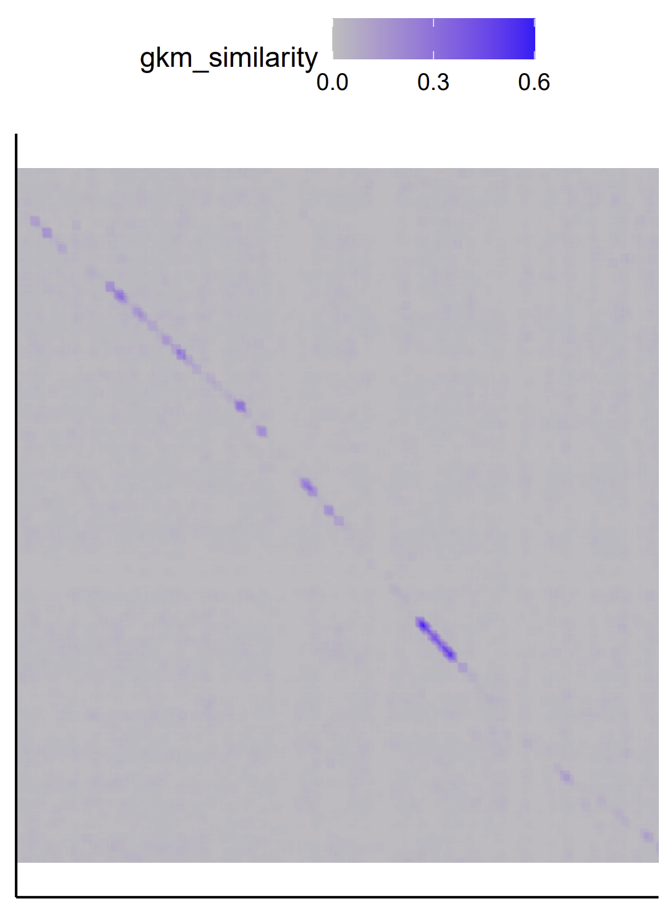
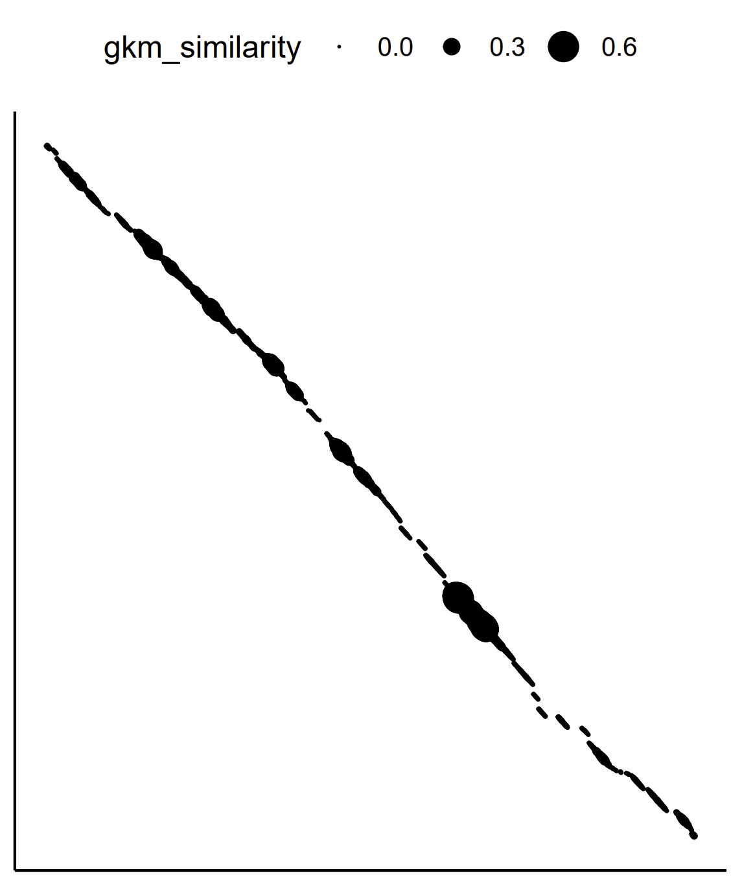

# Table of Contents
- [Introduction](#introduction)
- [System Requirements](#system-requirements)
- [Installation](#installation)
- [Testing](#testing)
- [Running gkm-align](#running-gkm-align)
  - [Local Sequence Alignment and Mapping](#local-sequence-alignment-and-mapping)
    - [Example: HBB Locus Control Region](#example-hbb-locus-control-region)
    - [Example: FADS Gene Cluster Loci](#example-fads-gene-cluster-loci)
  - [Whole-genome Alignment and Mapping](#whole-genome-alignment-and-mapping)
    - [Genome Alignment](#genome-alignment)
      - [Pre-processing for genome alignment](#pre-processing-for-genome-alignment)
      - [Cell-type-independent unweighted genome alignment](#cell-type-independent-unweighted-genome-alignment)
      - [Cell-type-specific model-weighted genome alignment](#cell-type-specific-model-weighted-genome-alignment)
    - [Genome-wide Mapping](#genome-wide-mapping)
- [Other](#other)
  - [Generating gkm-SVM genomic background models](#generating-gkm-svm-genomic-background-models)  
- [Future](#future)
- [Software Updates](#software-update)

# Introduction
gkm-align is a whole-genome alignment algorithm designed to map distal enhancers conserved between distant mammals (e.g., human and mouse). It discovers orthologous enhancers by identifying alignment paths with maximal similarity in gapped-kmer compositions along syntenic loci. Performance can be enhanced by incorporating conserved enhancer vocabularies obtained using gkm-SVM sequence models trained on enhancers.

Two main modes:
- Alignment mode (-t 1): Performs interspecies sequence alignment (similar to LASTZ)
- Mapping mode (-t 2): Maps sequences based on alignment results (similar to liftover) 

Please cite the following paper if you use gkm-align:

**Oh, J.W., Beer, M.A.** Gapped-kmer sequence modeling robustly identifies regulatory vocabularies and distal enhancers conserved between evolutionarily distant mammals. **Nature Communications** 15, 6464 (**2024**). https://doi.org/10.1038/s41467-024-50708-z

Also, visit the [gkm-align webpage](https://beerlab.org/gkmalign/) to find useful resource files for running gkm-align. 

> **Note:** You can now use gkm-align through our Python wrapper. Install with `pip install gkmalign` and use it in Python scripts. See the [gkm-align Python repository](https://github.com/oh-jinwoo94/gkmalign-python) for detailed instructions and examples.
> 
# System Requirements
gkm-align is designed for Linux-based operating systems (Red Hat, CentOS, Rocky Linux, etc.).
**Tested on:** Rocky Linux release 8.8 (Green Obsidian)

**SIMD Requirements:**
- **AVX2 support**: Maximum lmer length = 32
- **SSE2 support**: Maximum lmer length = 16

**Check your system's SIMD support:**
- AVX2: `lscpu | grep avx2`
- SSE2: `lscpu | grep sse2`

**Without SIMD support:** You can only use mapping mode (-t 2) with precomputed genome alignment files (e.g., [hg38-mm10_unweighted.coord](https://beerlab.org/gkmalign/hg38-mm10_unweighted.coord))

**Note:** Attempting to use alignment mode (-t 1) without SIMD support will result in an error during argument parsing.

 
# Installation
First, download the source code using the following command line:
<pre>
git clone https://github.com/oh-jinwoo94/gkm-align.git
</pre>

Then, compile and set up gkm-align using the following command:
<pre>
bash setup.sh
</pre>
The script **1)** compiles gkm-align and **2)** downloads gkm-SVM genomic background models (human & mouse) to the 'data/' directory.

Additionally, if you press y (recommended for following the tutorial more easily), **3)** hg38 and mm10 genomes will be downloaded to the 'data/' directory (approximately 6 gigabytes).

# Testing
To verify that gkm-align is working correctly, you can run the built-in test:

<pre>
cd test
bash test_hbb_lcr.sh
</pre>

This test will:
1. Download required files (background models and specific chromosomes)
2. Run gkm-align to align loci and map enhancers
3. Compare output with expected results
4. Report success or failure

# Running gkm-align
## Local sequence alignment and mapping 

### Example: HBB Locus Control Region
In this section, we use gkm-align to align the human and mouse HBB Locus Control Region (HBB-LCR) and map mouse HBB-LCR enhancers to human genome (Oh and Beer, **Figure 3G**). 

Enter the following commands.
<pre>
cd examples/HBB_LCR
bash run_gkmalign.sh
</pre>

The 'run_gkmalign.sh' script has three main parts.

**1)** Setting up gkm-align input file (specifying gkm-SVM genomic masker models to be used) and output directory. 
<pre>
echo "../../data/mouse_genomic_background_model_p_0.1.out" > masker_models.txt
echo "../../data/human_genomic_background_model_p_0.1.out" >> masker_models.txt
mkdir output_files
</pre>

**2)** **Aligning** human and mouse HBB-LCRs. 
<pre>
../../bin/gkm_align  -t 1 -d ../../data/genomes/ -g masker_models.txt -p 50 -o output_files -n HBB_LCR_mm10-hg38 HBB.to_align
</pre>
  * **'-t 1 HBB.to_align'**: Specifies that gkm-align is in "align" mode and uses the input file HBB.to_align, which contains the genomic coordinates for both human and mouse HBB Locus Control Regions (LCRs)
  * **'-d ../../data/genomes'**: Specifiies directory containing the genome data files for human (hg38) and mouse (mm10). These directories should contain chromosome sequence files (e.g., chr1.fa, chr2.fa).
  * **'-g masker_models.txt'**: Specifies the genomic background model to use for repeat masking, which helps reduce alignment errors by masking repetitive sequences.
  * **'-p 50'**: Uses 50 parallel threads to speed up processing. This can be adjusted based on available computational resources.
  * **'-o' and '-n'**: Specify the output directory and output file prefix, respectively.

This step generates 'output_files/HBB_LCR_mm10-hg38.coord', which is used as an input for the following step. 
  
**3)** **Mapping** mouse HBB-LCR enhancers to human. 
<pre>
../../bin/gkm_align  -t 2 -c output_files/HBB_LCR_mm10-hg38.coord -q mm10 -m -o output_files -n HBB_LCR_enhancers_mm10_mapped_to_hg38 HBB_LCR_enhancers_mm10.bed
</pre>
  * **'-t 2 -c output_files/HBB_LCR_mm10-hg38.coord'**: Specifies that gkm-align is in "mapping" mode and uses the output from the alignment step (-t 1) as the coordinate mapping file.
  * **'HBB_LCR_enhancers_mm10.bed'**: Input file containing the mm10 coordinates of mouse HBB-LCR enhancers.
  * **'-c output_files/HBB_LCR_mm10-hg38.coord'**: Uses the output from the alignment step (-t 1) as the coordinate mapping file.
  * **'-q mm10'** : Indicates that the query enhancers.bed file is in the mm10 (mouse) genome.
  * **'-m'**: Allows multiple mappings for enhancers that may align to several locations.
  * **'-o' and '-n'**: Specify the output directory and output file prefix, respectively.

Details on other software options can be found by typing:
<pre>
../../bin/gkm_align -h
</pre>

This process takes between 10 seconds and a few minutes depending on your hardware availability.

### Example: FADS Gene Cluster Loci
In this section, we align the human and mouse FADS gene cluster loci. 

Enter the following commands.
<pre>
cd examples/FADS_cluster
bash run_gkmalign.sh
</pre>

'run_gkmalign.sh' in this example is almost identical to the version in the previous HBB-LCR example. 
For example, the 'run_gkmalign.sh' script contains the following command lnes:
<pre>
../../bin/gkm_align  -t 1 -d ../../data/genomes/ -g masker_models.txt -p 50 -o output_files -n FADS_loci_mm10-hg38 -G FADS_loci.to_align
</pre>
 * Adding '-G' option outputs matrix G (binary) to an output directory specified by -o, for each line in the input file with '.to_align' suffix. Output matrix G file is named automatically based on the genomic ranges from which the matrix was computed. 

You can convert the output binary file into a tab-separated file by running:
<pre> 
../../bin/binary_matrix_2_tsv output_files/mm10-chr19-10194014-10214169-hg38-chr11-61782802-61802911-diff_strand.matrixG output_files/mm10-chr19-10194014-10214169-hg38-chr11-61782802-61802911-diff_strand.tsv
</pre>

Two visualize FADS locus gkm-align output, run 
<pre>
Rscript ../../scripts/visualize_matrix.R output_files/mm10-chr19-10194014-10214169-hg38-chr11-61782802-61802911-diff_strand.tsv invert
Rscript ../../scripts/visualize_coordinates.R output_files/FADS_loci_mm10-hg38.coord
</pre>

| FADS locus gkmsim matrix (G) | FADS gkm-alignment coordinates |
| ------- | ------- |
|  |  |

This process takes between 10 seconds and a few minutes depending on your hardware availability.

## Whole-genome Alignment and Mapping

> **NOTE:**  
> The pipeline described in this section performs whole-genome alignment limited to human-mouse syntenic intergenic loci to prioritize sequence matches with high evolutionary and functional relevance. Approximately 10-15% of human and mouse enhancers fall outside these regions and will not be mapped. If you wish to align regions that are excluded by this filter, you can manually add the relevant syntenic region to the `.to_align` file.  

### Genome Alignment
#### Pre-processing for Genome Alignment
The previous examples (HBB LCR and FADS loci) demonstrated how gkm-align can align a pair of human and mouse loci when their genomic coordinate ranges are well defined, as below:
<pre>
[HBB LCR]
mm10 chr7 103851395 103883181 hg38 chr11 5267522 5302220 same_strand

[FADS locus]
mm10 chr19 10194014 10214169 hg38 chr11 61782802 61802911 diff_strand*
(*note: 'diff_strand' indicates that the human and mouse loci are inverted relative to each another in their respective genome builds.)
</pre>

gkm-align can be applied at the whole-genome level by providing a pre-computed list of conserved syntenic loci. It may consist of a list of flanking windows around known conserved transcription start sites, or it may include a list of predicted syntenic intergenic loci derived from a comprehensive list of short sequence matches, as was done for the gkm-align manuscript. In this part of the tutorial, I will describe how to perform whole-genome alignment with gkm-align using syntenic intergenic loci generated using short sequence matches. 

To generate the list of human-mouse syntenic intergenic loci, run the following command lines:
<pre>
cd examples/whole_genome/ 
bash generate_syntenic_loci_to_align.sh
</pre>
The pipeline encoded in the [shell script](examples/whole_genome/generate_syntenic_loci_to_align.sh) consists of three parts:
1) The pipeline runs the [**LASTZ**](https://github.com/lastz/lastz/) software to generate a comprehensive list of short sequence matches between human and mouse genomes. This step is computationally intensive, and it may take more than 5 days to run depending on hardware availability. For aligning human and mouse (hg38,mm10), this step can be skipped by downloading the output file we have uploaded ([beerlab](https://beerlab.org/gkmalign/short_sequence_human-mouse_syntenic_intergenic.txt)). The pipeline allows you to choose between the two options, and outputs 'short_sequence_human-mouse_syntenic_intergenic.txt'.

2) To generate syntenic blocks, the pipeline runs the **'chain_short_seq_matches.py'** script, which partitions the generated list of short sequence matches to identify and chain together nearby collinear sequence matches in the 2D coordinate space of human and mouse genomes. The script is based on the algorithm described in [Zhang et al. (1994)](https://www.liebertpub.com/doi/10.1089/cmb.1994.1.217), which we have adapted for more intuitive parameterization and simpler usage. This step generates 'short_sequence_human-mouse_syntenic_intergenic.chains'.

3) The last step of the pipeline is to run **'convert_chain_to_to-align.py'**. Syntenic loci, derived from chaining sequence matches in the previous two steps, tend to be very large, making it computationally intensive to compute the gapped-kmer similarity matrices. This code helps expedite the process by breaking the syntenic blocks into smaller pieces through K-means clustering of the sequence matches based on their 2D human-mouse coordinates within each chain. The number of clusters (k) for each chain is automatically determined using the average target block size. The resulting centroids are then used to define the edges of the smaller syntenic blocks. This step generates 'human_mouse_WG_syntenic_intergenic_loci.to_align', which is then used as input for the gkm-align whole genome alignment.  

The following figure shows an example output from running the pipeline described above (GNA12 inversion locus). **Step 1** generates the dots. **Step 2** chains the dots, with each dot colored according to its assigned chain. **Step 3** generates the rectangles, which define the boundaries of syntenic blocks which can then be used as input for gkm-align whole-genome alignment. 

This pipeline generates '[**human_mouse_WG_syntenic_intergenic_loci.to_align**](examples/whole_genome/human_mouse_WG_syntenic_intergenic_loci.to_align)'. 

 

#### Cell-type-independent Unweighted Genome Alignment

Using '[human_mouse_WG_syntenic_intergenic_loci.to_align](examples/whole_genome/human_mouse_WG_syntenic_intergenic_loci.to_align)' from the previous section, you can now perform whole-genome alignment by running:
<pre>
bash run_gkmalign.sh human_mouse_WG_syntenic_intergenic_loci.to_align
</pre>

To try this pipeline for a smaller input, using a fraction of the syntenic intergenic loci, run: 
<pre>
head -10 human_mouse_WG_syntenic_intergenic_loci.to_align > subset_human_mouse_WG_syntenic_intergenic_loci.to_align
bash run_gkmalign.sh subset_human_mouse_WG_syntenic_intergenic_loci.to_align
</pre>

The [shell script](examples/whole_genome/run_gkmalign.sh) first generates masker_models.txt, which contains file paths to gkm-SVM genomic background models for human and mouse. These files are downloaded to data/ when setting up gkm-align (using bash setup.sh). The script then runs gkm-align on the syntenic blocks with the following command:

<pre>
../../bin/gkm_align  -t 1 -d ../../data/genomes/ -g masker_models.txt -p 50 -o output_files -n hg38-mm10_unweighted -G human_mouse_WG_syntenic_intergenic_loci.to_align
</pre>

This command line will generate '[**hg38-mm10_unweighted.coord**](https://beerlab.org/gkmalign/hg38-mm10_unweighted.coord)'.

The '-G' option locally saves all the gapped-kmer matrices computed in the directory specified with '-o'. Since computing the gapped-kmer matrices is the most time-consuming part of the algorithm, locally saving the matrices allows the whole-genome alignment to be resumed if the process is interrupted. This option is recommended only if your system has sufficient disk space.

The -G option is particularly useful if you plan to run gkm-align multiple times with various gkm-SVM enhancer models, as it allows the software to reuse previously generated gkm-matrices found in the output directory (-o). For whole genome alignment, this option should be used with discretion because it requires a large disk space (~3TB for hg38-mm10).  Without the locally saved matrices, whole-genome alignment of hg38 and mm10 take about a day with 50 threads ('-p 50'). With the matrices,  whole-genome alignment takes about three hours. 

In general, whole-genome alignment is computationally intensive, and the necessary computational resources may not be available for some users. In such cases, we recommend downloading our pre-computed alignment outputs (analogous to [LiftOver/LASTZ](https://hgdownload.cse.ucsc.edu/goldenpath/hg38/liftOver/)'s .chain files). These files can be downloaded from our lab website ([beerlab.org](https://beerlab.org/gkmalign/)) under "Output files of aligning the hg38 and mm10 genomes with gkm-align".

#### Cell-type-specific Model-weighted Genome Alignment
The [run_gkmalign_cell-weighted.sh](examples/whole_genome/run_gkmalign_cell-weighted.sh) shell script describes how to compute cell-specific whole-genome alignment using enhancer sequence models (gkm-SVM).

The first step is to download the relevant sequence models. For example, to perform alignment weighted toward embryonic brain enhancers, first download the gkm-SVM embryonic brain enhancer models for human (DHS_790_hg38) and mouse (DHS_97_mm10). The full list of enhancer models can be found at the following links: [human-model-list](https://beerlab.org/gkmalign/Supplementary_Table_2.txt) and [mouse-model-list](https://beerlab.org/gkmalign/Supplementary_Table_3.txt). Using the model aliases, you can download the models from these links: [human-model-repo](https://beerlab.org/gkmalign/human) and [mouse-model-repo](https://beerlab.org/gkmalign/mouse). These files include the enhancer-kmer weights and additional information used to compute gkm-SVM prediction scores, which range from 0 to 1.

After downloading the model files, you can run enhancer-model-weighted gkm-align using the '-W' option. For example, to run embryonic-brain-weighted alignment with a model weight of c=0.5, include '-W,0.5,sequence_model_files.txt', where each line of '[sequence_model_files.txt](examples/whole_genome/sequence_model_files.txt)' specifies the file path to the enhancer models downloaded in the previous step.

<pre>
../../bin/gkm_align -t 1 -g masker_models.txt -d /mnt/data0/joh27/genomes/ -W 0.5,sequence_model_files.txt -p 50 -o output_files/ -n hg38-mm10_enhancer-model-weighted_DHS_790_hg38-DHS_97_mm10_c-0.5 subset_human_mouse_WG_syntenic_intergenic_loci.to_align
</pre>

The pipeline described above can be executed with the following command:

<pre>
bash run_gkmalign_cell-weighted.sh human_mouse_WG_syntenic_intergenic_loci.to_align human_mouse_WG_syntenic_intergenic_loci.to_align DHS_790_hg38 DHS_97_mm10 0.5
</pre>

This command  line will generate [hg38-mm10_enhancer-model-weighted_DHS_790_hg38-DHS_97_mm10_c-0.5.coord
](https://beerlab.org/gkmalign/coords/hg38-mm10_enhancer-model-weighted_DHS_790_hg38-DHS_97_mm10_c-0.5.coord) 

To try this pipeline for a smaller input using a fraction of the syntenic intergenic loci, run:
<pre>
head -10 human_mouse_WG_syntenic_intergenic_loci.to_align > subset_human_mouse_WG_syntenic_intergenic_loci.to_align
bash run_gkmalign_cell-weighted.sh subset_human_mouse_WG_syntenic_intergenic_loci.to_align human_mouse_WG_syntenic_intergenic_loci.to_align DHS_790_hg38 DHS_97_mm10 0.5
</pre>

### Genome-wide Mapping
This section demonstrates how to use the alignment outputs from the [previous section](#genome-alignment) to map genomic sequences conserved between human and mouse. 

First, download the human embryonic brain enhancers ([DHS_790_hg38_300_noproms_nc30.bed](https://beerlab.org/gkmalign/human_enh/DHS_790_hg38_300_noproms_nc30.bed)) from our [lab website](https://beerlab.org/gkmalign). We have uploaded all the enhancer sets for the 45 pairs of human and mouse cell/tissues that we used to quantify enhancer conservation and to evaluate gkm-align. You can identify the cell/tissue source for each enhancer set using this [catalog](https://beerlab.org/gkmalign/Supplementary_Table_4.txt). For more details on the biosamples, you can search for their ENCODE accession IDs (listed in the following links: [human](https://beerlab.org/gkmalign/Supplementary_Table_2.txt), [mouse](https://beerlab.org/gkmalign/Supplementary_Table_3.txt)) on the [ENCODE portal](https://encodeproject.org). 

The enhancer bed files contain DNase-signal strength recorded for each enhancer in the fourth column. Before running gkm-align, re-format the query enhancer file so that the fourth column contains unique element identifiers. 
<pre>
awk '{print $1"\t"$2"\t"$3"\t"$1":"$2"-"$3}' DHS_790_hg38_300_noproms_nc30.bed > human_brain_enhancers.bed
</pre>

To map human embryonic brain enhancers to the mouse genome using [hg38-mm10_unweighted.coord](https://beerlab.org/gkmalign/hg38-mm10_unweighted.coord), run the following command line: 

<pre>
../../bin/gkm_align  -t 2 -c hg38-mm10_unweighted.coord -q hg38 -m -o output_files -n human_brain_enhancers_mapped_to_mm10 human_brain_enhancers.bed
</pre>
 
This generates two files with the following suffixes: `.multiple_mapped` and `.multiple_not_mapped`. These file formats are designed to match the output file formats of LiftOver. Similarly, using `-u` option (which filters out duplicate mappings) generates `unique_mapped` and `.unique_not_mapped`. However, we recommend the `-m` option to obtain the full range of interspecies mappings, as gkm-align provides conservation metrics for evaluating each mapping. 

 `.multiple_mapped` contains the mapped mouse coordinates (column 1-3) for each of the query enhancers (column 4). The fifth column contains unique identifiers for mouse loci that were mapped from a single query human enhacer. Additionally, the fifth column contains the gkm-similarity score between the query human enhancer and the mapped mouse element. Mapping outputs from using enhancer-model-weighted `.coord` files include two extra columns containing interspecies gkm-SVM prediction scores (column 6 and 7 each encoding gkm-SVM scores of the mapped and query DNA elements). The gkm-similarity and gkm-SVM scores both range from 0 to 1, and they can be used for quantifying the conservation level or confidence level of gkm-align mapping. 

`.multiple_not_mapped` contains the list of query enhancers that failed to map to the other species. There are two possible ways that this can happen:
  - **Case 1**: Not mapped because they are **outside the syntenic regions**, meaning they do not overlap any syntenic region recorded in the `.coord` file.
  - **Case 2**: Not mapped because they are **deleted**, meaning they overlap a syntenic region in the `.coord` file but are determined to be unconserved during the alignment process (i.e., indel).

If you wish to align regions that are excluded in the input syntenic regions, you can manually add the relevant syntenic region to the `.to_align` file.

# Other
## Generating gkm-SVM genomic background models
In this section, I describe how to train gkm-SVM to learn background genomic sequences. The goal is to identify sequence patterns that are prevalent in genomic data (e.g., repetitive patterns like ATATATATATA). To achieve this, we train gkm-SVM using samples of genomic sequences against randomly generated sequences, where each base (A, C, G, T) is equally probable (P(A) = P(C) = P(G) = P(T)).

### Example output: 
The output of this training process is the file `data/human_genomic_background_model_p_0.1.out`, which can also be downloaded by running `bash setup.sh`.

### To train the background model:
First, navigate to the appropriate directory and set up lsgkm:
<pre>
cd etc/how_to_generate_genomic-background-models_for_gkm-SVM-repeat-masking/hg38/
bash setup_gkmsvm.sh
</pre>

Then, train the background model by running the following script: 
<pre>
# Details of the pipeline are provided within the script
bash generate_genomic_background_model.sh 10 30000 0.1 
</pre>

For the results presented in the manuscript, we sampled as many genomic sequences as possible to minimize sampling noise. The parameters specified above generate **10** independent gkm-SVM human genomic background models, which are then averaged to produce the final model. Each background model is trained on **30,000** genomic DNA sequences of length 300, sampled from the human genome, against to 30,000 randomly generated DNA sequences (real biological sequences vs. synthetic sequences).

The resulting kmer weight vector (averaged across the 10 models) quantifies the prevalence of each kmer in the genome. In gkm-align, this kmer weight is used to score each base pair in the genome, where nucleotides with scores above a certain threshold are masked. We select a threshold that masks 10% (**0.1**) of the genome.

### Note for computational efficiency:
The sequence patterns that gkm-SVM is learning here are relatively simple and may not require the large number of training sequences used in this example (10 x 30,000). As mentioned in the manuscript (Supp. Fig. 14 in Oh and Beer, Nat Comm 2024), the background models for human and mouse genomes are quite similar, although some differences exist.

If you want to generate background models for other species but lack sufficient computing power, consider reducing the training size (e.g., 10 →  5, 30,000 →  10,000). Alternatively, you could use the human and mouse models, as the model you create will likely be similar to these. However, for optimal performance, we recommend generating species-specific background models using as many training sequences as possible.

### To test the model
Once the model is generated, you can test it by running the following command:
<pre>
../../../bin/mask_fa files/test_hg38.fa ../../../data/human_genomic_background_model_p_0.1.out test_hg38_gkm-masked.fa
</pre>

<pre>
>Before masking
CCTGGGTGACTGAGTGAGATCCTGTCTCAAAGAAAAATAAAAATAAAAAAAGTAATGTCACATGTGTAATCTTAATTTTTTTCTTCCCACCAACATTGCCAATTAAATTCCCACATTAAACTTTCTATAAGACAAATAATTTTAATGTTACTTAAATGTGTACAAGAATGCCATAGTCCCCTTTGCAGAAATGTCATTTAAAACAGTACTCTTTCATACAATAATTTCTATGTTTCTAGTCTTACTTACTTTCTTTCTTTCTTTCTTTCTTTTTTTTTTGAGACAGAGTCTCGCCCTGTC

>After (lower case for masked)
CCTGGGTGACTGAGTGAGATCCTGTCTCAaagaaaaataaaaataaaaaaaGTAATGTCACATGTGTAATCTTAatttttttcttcCCACCAACATTGCCAATTAAATTCCCACATTAAACTTTCTATAAGACAAataattttaATGTTACTTAAATGTGTACAAGAATGCCATAGTCCCCTTTGCAGAAATGTCATTTAAAACAGTACTCTTTCATACAATAATTTCTATGTTTCTAGTCTTACTTACtttctttctttctttctttcttttttttttgAGACAGAGTCTCGCCCTGTC
</pre>

Note: The `mask_fa` utility is designed specifically for this instruction. You do not need to manually mask sequences when using gkm-align. It automatically performs the masking step when you run the alignment.

# Future
Although this README is sufficient for running gkm-align, it will be updated with additional information **by request**. Future updates will include, but are not limited to, instructions on the following:

- Generating quantitative catalogs of conserved enhancers annotated with various gapped-kmer-based conservation scores (provided in the [gkm-align website](https://beerlab.org/gkmalign/) under the "Tables of orthologous human/mouse enhancers..." section; e.g., [embryonic brain](https://beerlab.org/gkmalign/gkm-align_mapping/DHS_790_hg38_enhancers_h2m_unweighted.tsv)).

- Generating posterior gkm-SVM kmer-weight files (for generating prediction values ranging from 0-1).
- Generating gkm-align logo visualization (e.g., [Fig. 5C](https://www.nature.com/articles/s41467-024-50708-z#Fig5) of the manuscript).

Regardless, all necessary information required for performing these analyses is included in the [manuscript](https://www.nature.com/articles/s41467-024-50708-z). Mathematical details of the gkm-align algorithm are provided on pages 41 to 48 of the Supplementary Information document of the manuscript. 

# Software Updates

---
## 2024-12-1
- **Minor update**: gkm-align (option `-t 2`) generates `.mapped` and `.not_mapped` files, similar to LiftOver. The format of the `.not_mapped` file has been updated to provide more detailed information on why certain elements did not map.
  - **Case 1**: Not mapped because they are **outside the syntenic regions**, meaning they do not overlap any syntenic region recorded in the `.coord` file.
  - **Case 2**: Not mapped because they are **deleted**, meaning they overlap a syntenic region in the `.coord` file but are determined to be unconserved during the alignment process (i.e., indel).

# Authors
- Jin Woo Oh *
- Michael A. Beer *
