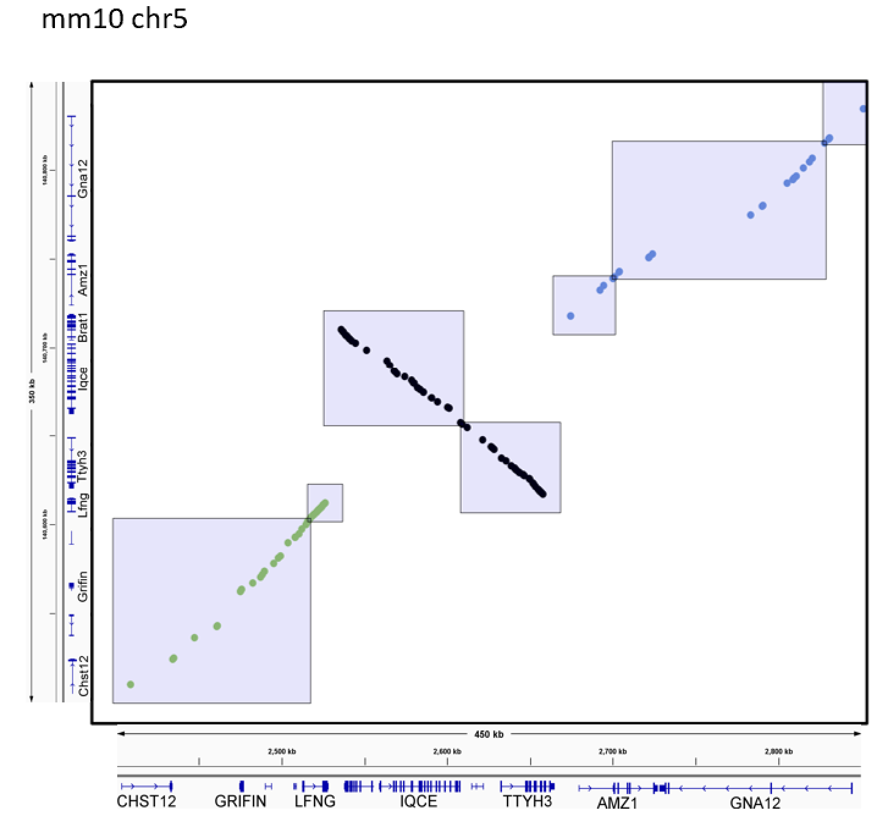

(being updated with more detail and examples)

# Table of Contents
- [Introduction](#introduction)
- [System Requirements](#system-requirements)
- [Installation](#installation)
- [Running gkm-align](#running-gkm-align)
  - [example: HBB Locus Control Region](#example-hbb-locus-control-region)
  - [example: FADS gene cluster loci](#example-fads-gene-cluster-loci)
  - [example: human-mouse whole-genome alignment](#example-human-mouse-whole-genome-alignment)
  
# Introduction
gkm-align is a whole-genome alignment algorithm designed to map distal enhancers conserved between distant mammals (e.g., human and mouse). gkm-align discovers orthologous enhancers by identifying alignment paths with maximal similarity in gapped-kmer compositions along syntenic loci. gkm-align's performance can further be enhanced by incorporating conserved enhancer vocabularies obtained using gkm-SVM sequence models trained on enhancers. 

Please cite the following paper if you use gkm-align:
Oh JW and Beer MA. Gapped-kmer sequence modeling robustly identifies regulatory vocabularies and distal enhancers conserved between evolutionarily distant mammals. 
[bioRxiv](https://www.biorxiv.org/content/10.1101/2023.10.06.561128v1)

# System Requirements
gkm-align software is built for Linux-based operating systems (such as Red Hat, CentOS, and Rocky Linux, etc.).
The package has been tested on the following system:
* Rocky Linux release 8.8 (Green Obsidian).

gkm-align uses SIMD parallel computation and requires AVX2 (to check availability: 'lscpu | grep avx2'). 
 
# Installation
First, download the source code using the following command line:
<pre>
git clone https://github.com/oh-jinwoo94/gkm-align.git
</pre>

Then, compile and set up gkm-align using the following command:
<pre>
bash setup.sh
</pre>
The script **1)** compiles gkm-align and **2)** downloads gkm-SVM genomic background models (human & mouse) to the 'data/' directory.

Additionally, if you press y (recommended for following the tutorial more easily), **3)** hg38 and mm10 genomes will be downloaded to the 'data/' directory (approximately 6 gigabytes).

The entire process takes less than 3 minutes. 

# Running gkm-align

## example: HBB Locus Control Region
In this section, we use gkm-align to align the human and mouse HBB Locus Control Region (HBB-LCR) and map mouse HBB-LCR enhancers to human genome (Oh and Beer, **Figure 3G**). 

Enter the following commands.
<pre>
cd examples/HBB_LCR
bash run_gkmalign.sh
</pre>

The 'run_gkmalign.sh' script contains three parts.

**1)** Setting up gkm-align input file (specifying gkm-SVM genomic masker models to be used) and output directory. 
<pre>
echo "../../data/mouse_genomic_background_model_p_0.1.out" > masker_models.txt
echo "../../data/human_genomic_background_model_p_0.1.out" >> masker_models.txt
mkdir output_files
</pre>

**2)** **Aligning** human and mouse HBB-LCRs. 
<pre>
../../bin/gkm_align  -t 1  HBB.to_align -d ../../data/genomes/ -g masker_models.txt   -p 50 -o output_files -n HBB_LCR_mm10-hg38
</pre>
  * '-t 1' option specifies that gkm-align is in 'align' mode.
  * 'HBB.to_align' contains genomic coordinate ranges of human and mouse HBB Locus Control Regions that gkm-align will align. 
  * '-d ../../data/genomes' specifiies directory containing 'hg38/' and 'mm10/', each containing 'chr?.fa'. \
  * '-g masker_models.txt' specifies gkm-SVM genome background model to use for repeat masking.
  * '-p 50': use 50 parallel threads. Set to -p 1 if resources are limited.
  * '-o' and '-n' specify output directory and output file prefix, respectively.
  
**3)** **Mapping** mouse HBB-LCR enhancers to human. 
<pre>
../../bin/gkm_align  -t 2  HBB_LCR_enhancers_mm10.bed  -c output_files/HBB_LCR_mm10-hg38.coord -q mm10 -m -o output_files -n HBB_LCR_enhancers_mm10_mapped_to_hg3
</pre>
  * '-t 2' option specifies that gkm-align is in 'mapping' mode.  
  * 'HBB_LCR_enhancers_mm10.bed' contains mm10 coordinates of mouse HBB-LCR enhancers.
  * '-c output_files/HBB_LCR_mm10-hg38.coord': output of '-t 1' (align mode) to be use for mapping.
  * '-q mm10' specifies that the query 'enhancers.bed' is in mm10.
  * '-m': allows multiple mappings.
  * '-o' and '-n' specify output directory and output file prefix, respectively.

Details on other software options can be found by typing:
<pre>
../../bin/gkm_align -h
</pre>

This process takes between 10 seconds and a few minutes depending on your hardware availability.

## example: FADS gene cluster loci
In this section, we align the human and mouse FADS gene cluster loci. 

Enter the following commands.
<pre>
cd examples/FADS_cluster
bash run_gkmalign.sh
</pre>

'run_gkmalign.sh' in this example is almost identical to the version in the previous HBB-LCR example. 
For example, the 'run_gkmalign.sh' script contains the following command lnes:
<pre>
../../bin/gkm_align  -t 1  FADS_loci.to_align -d ../../data/genomes/ -g masker_models.txt   -p 50 -o output_files -n FADS_loci_mm10-hg38 -G
</pre>
 * Adding '-G' option outputs matrix G (binary) to an output directory specified by -o, for each line in the input file with '.to_align' suffix. Output matrix G file is named automatically based on the genomic ranges from which the matrix was computed. 

The output binary file can be converted into a tab-separated file by running: 
<pre> 
../../bin/binary_matrix_2_tsv output_files/mm10-chr19-10194014-10214169-hg38-chr11-61782802-61802911-diff_strand.matrixG output_files/mm10-chr19-10194014-10214169-hg38-chr11-61782802-61802911-diff_strand.tsv
</pre>

Two visualize FADS locus gkm-align output, run 
<pre>
Rscript ../../scripts/visualize_matrix.R output_files/mm10-chr19-10194014-10214169-hg38-chr11-61782802-61802911-diff_strand.tsv invert
Rscript ../../scripts/visualize_coordinates.R output_files/FADS_loci_mm10-hg38.coord
</pre>

| FADS locus gkmsim matrix (G) | FADS gkm-alignment coordinates |
| ------- | ------- |
|  |  |

This process takes between 10 seconds and a few minutes depending on your hardware availability.

## example: human-mouse whole-genome alignment

The previous two examples (HBB LCR and FADS loci) demonstrated how gkm-align can align a pair of human and mouse loci when their genomic coordinate ranges are well defined, as below:
<pre>
[HBB LCR]
mm10 chr7 103851395 103883181 hg38 chr11 5267522 5302220 same_strand

[FADS locus]
mm10 chr19 10194014 10214169 hg38 chr11 61782802 61802911 diff_strand*
(*note: 'diff_strand' indicates that the human and mouse loci are inverted relative to each another in their respective genome builds.)
</pre>

gkm-align can be applied at the whole genome level by providing a pre-computed list of conserved syntenic loci. It may consist of a list of flanking windows around known conserved transcription start sites, or it may include a list of predicted syntenic intergenic loci derived from a comprehensive list of short sequence matches, as was done for the gkm-align manuscript. In this part of the tutorial, I will describe how to perform whole-genome alignment with gkm-align using syntenic intergenic loci generated using short sequence matches. 

To generate the list of human-mouse syntenic intergenic loci, run following command lines. 
<pre>
cd examples/whole_genome/ 
bash generate_syntenic_loci_to_align.sh
</pre>
The pipeline encoded in the shell script consists of three parts:
1) The pipeline runs the [LASTZ](https://github.com/lastz/lastz/) software to generate a comprehensive list of short sequences between humand and mouse genomes. This step is computationally intensive, and it may take more than 5 days to run depending on hardware availability. For aligning human and mouse (hg38,mm10), this step can be skipped by downloading the output file we have uploaded ([beerlab](https://beerlab.org/gkmalign/short_sequence_human-mouse_syntenic_intergenic.txt)). The pipeline allows you to choose between the two options, and outputs 'short_sequence_human-mouse_syntenic_intergenic.txt'.

2) To generate syntenic blocks, the pipeline runs the 'chain_short_seq_matches.py' script, which partitions the generated list of short sequence matches to identify and chain together nearby collinear sequence matches in the 2D coordinate space of human and mouse genomes. The script is based on the algorithm described in [Zhang et al. (1994)](https://www.liebertpub.com/doi/10.1089/cmb.1994.1.217), which we have adapted for more intuitive parameterization and simpler usage. This step generates 'short_sequence_human-mouse_syntenic_intergenic.chains'.

3) The last step of the pipeline is to run 'convert_chain_to_to-align.py'. Syntenic loci, derived from chaining sequence matches in the previous two steps, tend to be very large, making it computationally intensive to compute the gapped-kmer similarity matrices. This code helps expedite the process by breaking the syntenic blocks into smaller pieces through K-means clustering of the sequence matches based on their 2D human-mouse coordinates within each chain. The number of clusters (k) for each chain is automatically determined using the average target block size. The resulting centroids are then used to define the edges of the smaller syntenic blocks. This step generates 'human_mouse_WG_syntenic_intergenic_loci.to_align', which is then used as input for the gkm-align whole genome alignment.  

 

# Authors
- Jin Woo Oh *
- Michael A. Beer *
